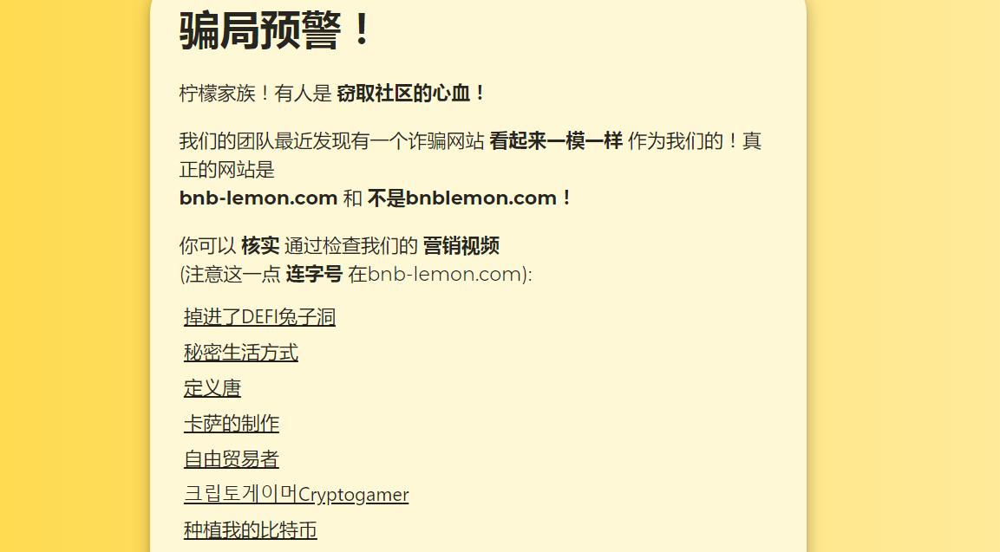
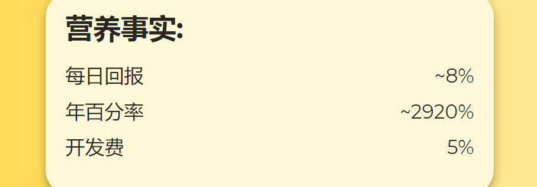

BNB Lemons 是一个您可以雇佣农民的地方，他们会不停地为您种植柠檬。&nbsp;

因此你可以用柠檬换取 BNB 奖励。

需要注意的是，由于我们做的太过于优秀，已经有不法分子尝试伪装我们并偷走您口袋里的钱。但我们决不允许这种事情发生，我们会尽全力保护您，并且让那些大胆的行骗者付出代价。

多么激动人心。尊敬的使用者，你完全可以从任何使用你的推荐链接的人那里赚取12%的BNB(购买柠檬)。这是我们的优势，我们相信，不会有比我们更加优秀的bnb了。请您选择我们。

如图所示，我们的**营养事实**是：

每日回报   ~8%

年百分率   ~2920%

开发费       5%

不要再等待，立刻行动起来。来经营您的农场吧。

我们是BNB Lemon。