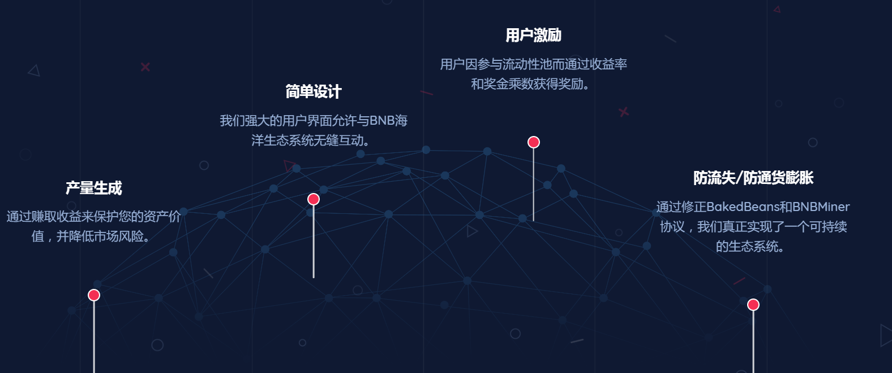

下一代单产农业协议。每天 1.25%，您的单产最高可提高 8 倍。&nbsp;

实施了定制设计的防鲸和防排水功能，以提高可持续性。 在此处了解我们的流动性保护功能

**在平静的水域航行**

在BNB海洋，我们通过我们的BNB海洋协议提供稳定的市场波动和被动收入。

我们的海洋协议通过Ұ区块链得到支持，以降低最终用户的费用并实现收益最大化。

这是一个定制的工程协议，改进了基本的采矿合同

**先进的高产农业策略**

在一个平台上赚取BNB或BUSD的收益。

日产量高达1.25%。用户可以移除流动性或复利来换取哈希。

购买哈希以增加池所有权。一旦散列被购买，它们就永远被拥有。

用户将获得高达100倍的奖励1.50倍每当流动性复合时，8.00倍助推是可以累计获得的。

享受独立于市场的利润。我们的协议提供了完全的市场独立性。

