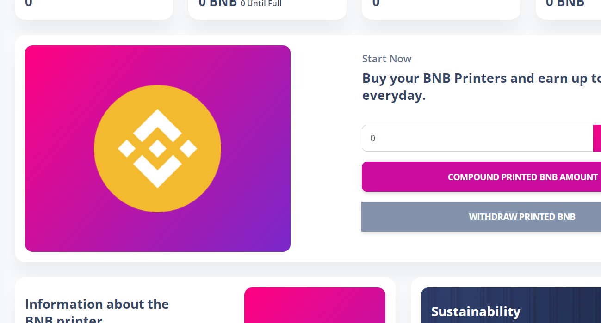

Money Printer 每天支付 6%，根据当前的打印效率。 挖矿效率会随着你和其他玩家购买打印机，再投资打印的BNB和提取BNB而上升和下降。

游戏的目标是重新投资以比其他玩家更快、更频繁地购买更多打印机。 这反过来又可以更快地为您赚取更多的 BNB。 使用您的每日 BNB 收入购买更多打印机将在 30 天或更短的时间内将您的打印机增加 4 倍。

BNB打印机信息：
Money Printer按照目前的打印效率，每天支付6%。 挖矿效率随着您和其他玩家购买打印机、打印的 BNB 再投资和 BNB 的退出而上升和下降。

游戏的目标是重新投资以比其他玩家更快、更频繁地购买更多打印机。 这反过来又可以更快地为您赚取更多的 BNB。 使用您的每日 BNB 收入购买更多打印机将在 30 天内或更短的时间内将您的打印机增加 4 倍。

