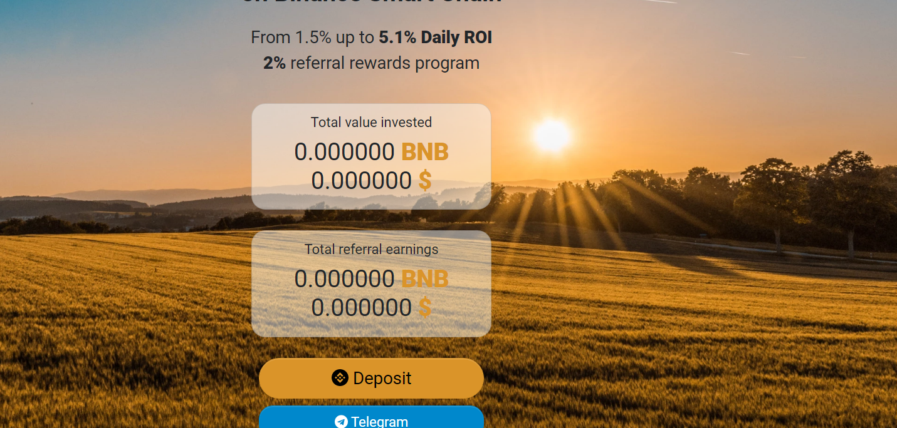

---
title: "BNB Yield Farm"
description: “BNB Yield Farm是币安智能链上一款稳定盈利的Yield Farming Dapp。
您将享受稳定的被动收入和高年利率。 每天赚取高达 5.1% 的 BNB。”
date: 2022-08-09T00:00:00+08:00
lastmod: 2022-08-09T00:00:00+08:00
draft: false
authors: ["ovorr"]
featuredImage: "bnb-yield-farm.png"
tags: ["High risk","BNB Yield Farm"]
categories: ["nfts"]
nfts: ["High risk"]
blockchain: "BSC"
website: "https://dappradar.com/deeplink/10814"
twitter: ""
discord: ""
telegram: "https://t.me/bnbyieldfarm"
github: ""
youtube: ""
twitch: ""
facebook: ""
instagram: ""
reddit: ""
medium: ""
steam: ""
gitbook: ""
googleplay: ""
appstore: ""
status: "Live"
weight: 
lightgallery: true
toc: true
pinned: false
recommend: false
recommend1: false
---

BNB Yield Farm 是增加您的 BNB 投资组合的明智而有效的方法。

 ✅ 盈利能力

1.5% 至 5.1% 的每日存款回报率。

您将享受稳定的被动收入和高年利率。&nbsp;

投资BNB，轻松赚取BNB。

 ✅ 推荐计划

您将因招聘人员的工作而获得可喜的回报。

从通过您的推荐链接进行的每笔存款中获得 2%。

**使用前阅读**
投资本金不可提取，唯一能获得的回报是每日分红和推荐奖励。
只有当合约余额有足够的 BNB 时，才能付款。
请在充值前分析智能合约的交易历史和余额。
高风险-高利润，DYOR！

**什么是 BNB 收益农场？**
BNB Yield Farm 是增加您的 BNB 投资组合的明智而有效的方式。我们拥有盈利能力，每日 1.5% 至 5.1% 的存款回报。您将享受稳定的被动收入和高年利率。并且只需投资BNB，即可轻松赚取BNB。我们推荐计划，同时您将因招聘人员的工作而获得愉快的回报。最后我们支持您从通过您的推荐链接进行的每笔存款中获得 2%。

