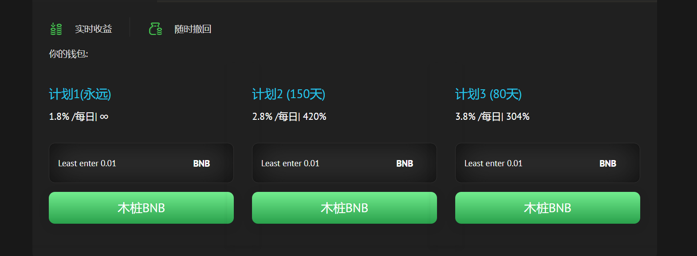

---
title: "BNBSeed Yield Farming Contract"
description: “三股计划
  1️⃣ Plan 1 1.8% Daily (Forever)
  2️⃣ 计划 2 2.8% 每日（150 天）
  3️⃣ 计划 3 3.8% 每日（80 天）
每天固定百分比"
date: 2022-08-09T00:00:00+08:00
lastmod: 2022-08-09T00:00:00+08:00
draft: false
authors: ["ovorr"]
featuredImage: "bnbseed-yield-farming-contract.png"
tags: ["High risk","BNBSeed Yield Farming Contract"]
categories: ["nfts"]
nfts: ["High risk"]
blockchain: "BSC"
website: "https://dappradar.com/deeplink/16724"
twitter: ""
discord: ""
telegram: "https://t.me/bnbseedOfficial"
github: ""
youtube: ""
twitch: ""
facebook: ""
instagram: ""
reddit: ""
medium: ""
steam: ""
gitbook: ""
googleplay: ""
appstore: ""
status: "Live"
weight: 
lightgallery: true
toc: true
pinned: false
recommend: false
recommend1: false
---

欢迎来到BNB Seed官方电报群

&nbsp;1️ 计划 1 &nbsp;&nbsp;1.8% 每日（永久）

&nbsp;2️计划 2 &nbsp;&nbsp;2.8% 每日（150 天）

&nbsp;3️Plan 3 &nbsp;&nbsp;3.8% 每日（80 天）

每天固定百分比

最小。 股权：0.01 BNB

实时收益

随时提现

推荐计划

10 级 &nbsp;&nbsp;

8%、2%、2%、1%、1%、0.5%、0.5%、0.5%、0.25%、0.25%

推荐奖励立即获得回报。

种子计划奖励🟢

例如 用户 A 推荐用户 B，用户 B 在计划 3 中投资了 10 BNB，每天获得 3.8%，因此用户 A 将有权获得 0.38 BNB 的 10%，即 每日 0.038 BNB。

一次推荐，持续收入。

**基础产量农业合同**

BNBSeed project是币安智能链上的一款去中心化app。been智能合同已由第三方审计员审计，并在bscscan上验证。bsed合同允许将BNB用于收益投资行业。BNBSeed项目的可持续性最终将使单一平台下的加密用户、采矿者、投资者在无限的机会下入股、参考和赚取种子收入。利用去中心化成为一个每秒运行的完美收益平台！

基于智能合同的交易协议自动执行所有用户之间的合同条款。与普通合同类似，双方用户必须就我们平台上的交易规则和条款达成一致。一旦商定并启动智能合同，它将按预期运行，不可能更改任何先前建立的条款。最低赌注从0.01 BNB开始，没有上限。其余的用户将实现工作交给合同，因此您不必坐几个小时来检查何时应该出售或购买。根据合同条款，这确保了您的投资价值不会减少，但为我们的用户提供了安全的投资回报。