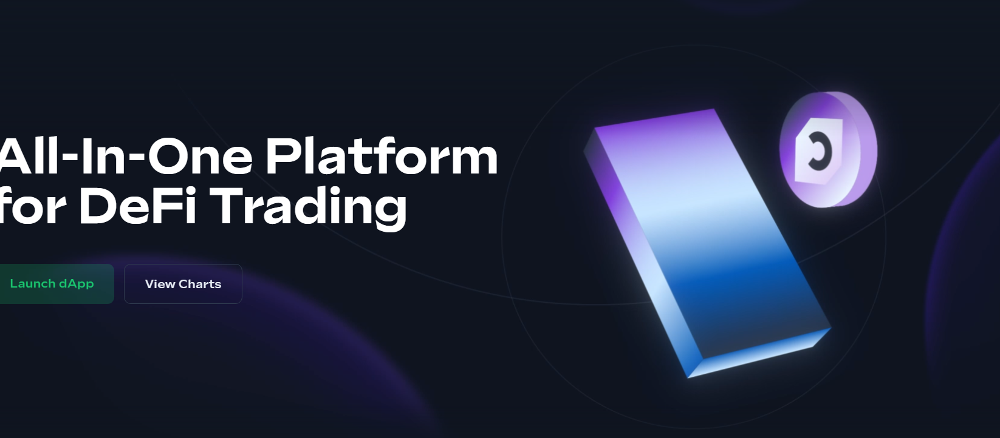

---
title: "Bogged"
description: “在 Pancakeswap、ApeSwap 等平台上交易、下限价单、止损和检查每个代币的图表。”
date: 2022-08-09T00:00:00+08:00
lastmod: 2022-08-09T00:00:00+08:00
draft: false
authors: ["ovorr"]
featuredImage: "bogged.png"
tags: ["Exchanges","Bogged"]
categories: ["nfts"]
nfts: ["Exchanges"]
blockchain: ""
website: "https://dappradar.com/deeplink/6334"
twitter: "https://twitter.com/boggedfinance"
discord: "https://discord.gg/boggedfinance"
telegram: "https://t.me/boggedfinance"
github: ""
youtube: ""
twitch: ""
facebook: "https://facebook.com/boggedfinance"
instagram: ""
reddit: "https://reddit.com/r/bogtools"
medium: ""
steam: ""
gitbook: ""
googleplay: ""
appstore: ""
status: "Live"
weight: 
lightgallery: true
toc: true
pinned: false
recommend: false
recommend1: false
---

Bogged Finance 是一个 dApp，其中包含一组工具，使用户可以轻松地在多个链上交易代币。 我们允许用户查看实时图表、钱包数据和配对信息。 我们还提供创新的 DEX 聚合，&nbsp;每天有数十万用户信任 Bogged Finance，在他们交易时获得准确、可靠的信息。

Bogged Finance 可帮助您在 DeFi 上更有效地进行交易。

<strong>完整的工具套件</strong>

<ul>
   <li>BogSwap：DEX 聚合器</li>
   <li>启动狙击手</li>
   <li>止损</li>
   <li>限价单</li>
   <li>图表等等！</li>
</ul>

<strong>开发者&amp; 令牌团队工具</strong>

<ul>
   <li>电报价格机器人</li>
   <li>Bogged 代币列表：代币信息库</li>
   <li>图表平台</li>
   <li>随机性预言机</li>
   <li>Oracle 调度程序</li>
</ul>

**什么是 Bogged DEX 聚合器？**

我们的免费 DEX 聚合器使用算法路由技术来确保您的交易以最优惠的价格进行。 高级功能、跨链兼容性和极快的速度将为您的 DeFi 交易赋能，并为您提供所需的优势。