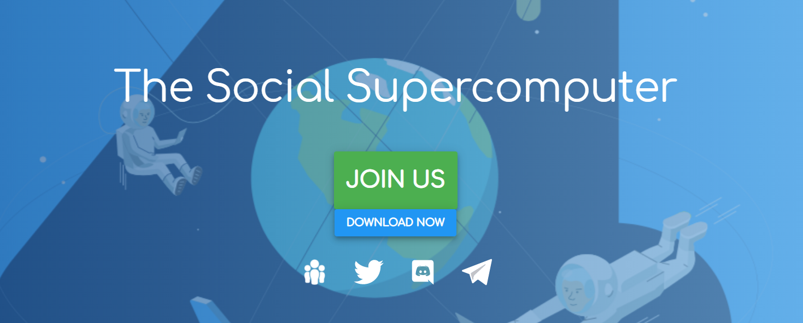

Boid 是一个 EOS 去中心化应用程序 (dApp)。 Boid 的核心是希望让所有人都能享受到区块链技术的好处。 Boid 作为网关，降低了非技术用户直接参与区块链和分布式计算项目的门槛。 Boid 是一个网站和软件平台，它为个人提供社交门户，以将他们的计算能力贡献给伟大的想法并获得奖励。 Boid 平台让用户可以轻松参与分布式计算项目。 Boid 还整合了最新的区块链协议，为共享闲置计算资源提供货币激励。

**为正义而战**

**我们的社区有真正的影响力**

团队领导围绕重要的目标团结用户。用户在全球排行榜上贡献他们的计算资源。用户可以因为他们的贡献赢得金钱和奖品。团队领导可以保留或捐赠从团队表现中获得的佣金。

