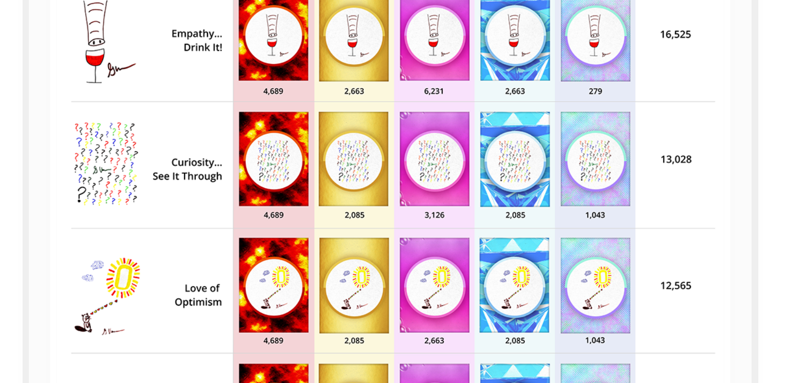

<strong>BOOK 游戏📖</strong> 代币是 16 幅绘制的艺术品，封装在五个 VeeFriends Spectacular 稀有品 Bubblegum、Lava、Diamond、Gold 和 Hologram 之一中。 每个令牌艺术品也被装在 15 个随机生成的帧中的 1 个中。 16 幅原创艺术品、5 种壮观稀有物品和 15 种不同框架的组合创造了 1,200 种不同 BOOK GAME 令牌稀有度类型的可能组合。

**烧毁的代币🔥**被发送到以太坊刻录地址(0x000...000).被烧毁的代币将永远消失，并且不能再用于玩图书游戏。当交换发生在[交易市场](https://veefriends.com/book-games/exchange)。只有成功进行的交易才会导致您的代币被烧毁。

**图书游戏📖**代币是16件绘制的艺术品，装在五件VeeFriends壮观的稀有物品泡泡糖、熔岩、钻石、黄金和全息图中的一件内。每个象征性的艺术品也被框在15个随机生成的框架中的一个中。16件原创艺术品、5件精美稀有物品和15个不同框架的组合创造了1，200种不同的游戏代币稀有类型的可能组合。